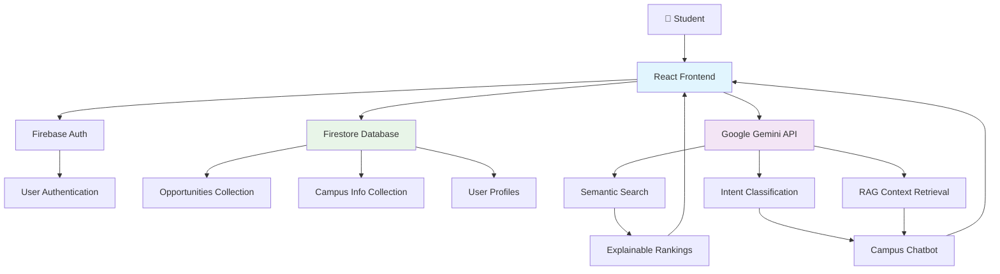
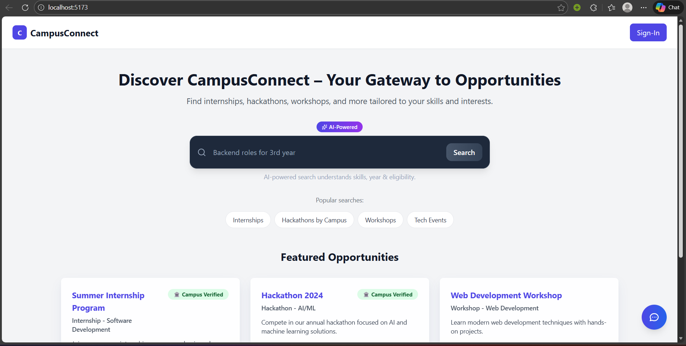
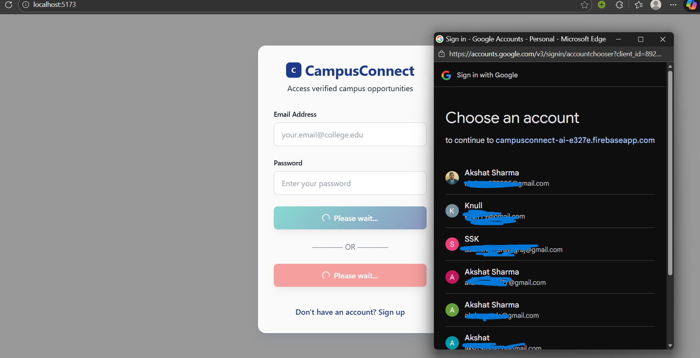
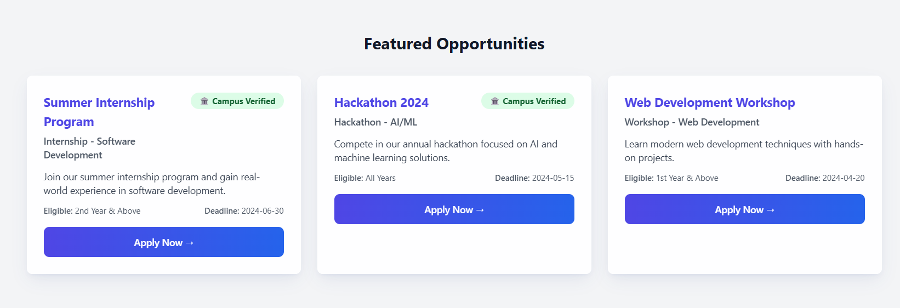
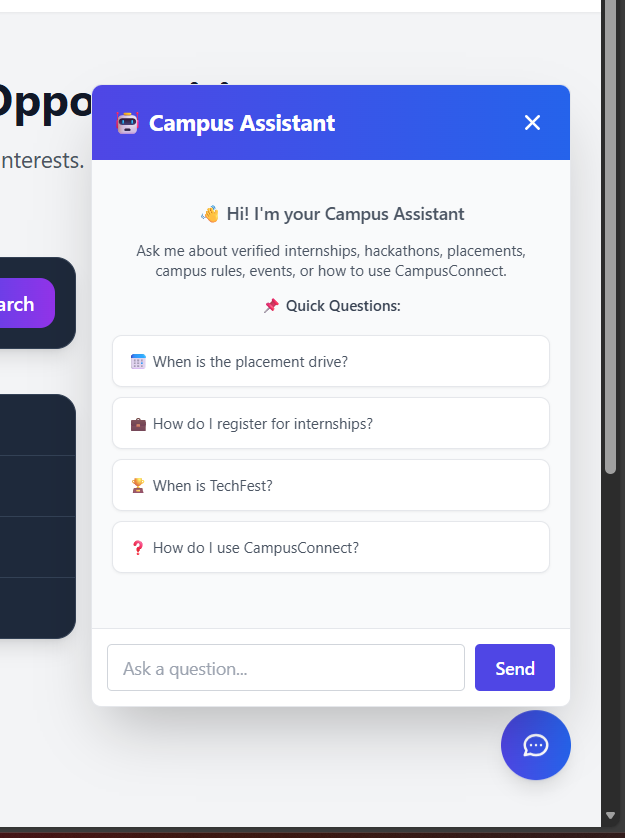

## 🎓 CampusConnectAI

CampusConnect-AI is an intelligent opportunity discovery platform built specifically for college students. The idea came from a simple but real problem: important opportunities are scattered everywhere — LinkedIn, WhatsApp groups, emails, posters, and multiple platforms — and students often miss out simply because information is fragmented.

CampusConnect-AI solves this by acting as a centralized, campus-focused hub for internships, hackathons, and workshops, while also ensuring that recommendations are personalized and explainable, not random.

Instead of just showing opportunities, the platform clearly tells the student why something is being recommended. For example:

“Recommended because it matches your Python skills and 3rd-year eligibility, and the deadline is approaching.”

This transparency is a core design decision, not an afterthought.

## 🤔 Why CampusConnect-AI?

Most existing opportunity platforms are generic and noisy. CampusConnect-AI is designed to be campus-first and student-centric.

Centralized access to campus opportunities

AI-based semantic matching instead of keyword search

Clear and transparent recommendation reasoning

Real-time updates without outdated listings

The goal is straightforward: help students discover the right opportunities at the right time, with clarity and confidence.

## 🏗️ System Architecture Flow

User authenticates via Firebase

Profile data loads from Firestore

Search query is processed by Gemini

Optional vector scoring via Vertex AI

Ranked and explainable results are returned to the frontend

Chatbot responses use RAG before generation

## 🏗️ Architecture Diagram



**Data Flow:**
1. User authenticates via Firebase Auth
2. Profile data stored in Firestore
3. Search queries processed by Gemini for semantic matching
4. Rankings calculated with transparent factors
5. Chatbot uses RAG to retrieve relevant campus context
6. Real-time updates sync with external APIs

---

## 📸 Demo / Screenshots

### Homepage Dashboard

*Clean, intuitive interface with search bar and featured opportunities*

### Login Page

*User authentication interface with Firebase integration*

### Event Cards with Explanations

*Detailed opportunity cards showing matching factors and verification badges*

### Campus Assistant Chatbot

*AI-powered assistant with sample queries and campus-focused responses*

---

## 🛠️ Technical Overview

The project uses a modern frontend stack, but the main intelligence lives in the backend and AI layers.

Frontend

React + Vite

Clean UI focused on clarity, speed, and transparency

🔥 Firebase – Backend Backbone

Firebase acts as the serverless backend infrastructure for the platform.

Authentication

Firebase Authentication with Google Sign-In

Each authenticated user maps to a unique profile document

Firestore Database

Firestore serves as the source of truth and is structured into focused collections:

opportunities – Stores internships, hackathons, and workshops with eligibility and deadline metadata

user_profiles – Stores student year, branch, and skills for personalization

campus_info – Knowledge base for campus-related chatbot queries

embedding_vector – Cached vector embeddings for performance optimization

Real-time Capabilities

New opportunities appear instantly for users when added or synced, without requiring page refreshes.

🧠 Google Gemini – Intelligence Layer

Google Gemini is the primary AI engine responsible for understanding queries, ranking results, and generating explanations.

Semantic Search

User queries are processed based on intent rather than keyword matching.
Example: “Internships for 3rd year CSE students”.

Explainable Recommendation Logic

Each opportunity is ranked using a relevance score.

80% weight from Gemini semantic understanding

Scoring factors:

Skills match – 25%

Year eligibility – 30%

Branch match – 20%

Deadline urgency – 20%

Campus verification – 15%

This allows the platform to explain why an opportunity is recommended.

🤖 Campus Assistant Chatbot

Performs intent classification to ensure campus-only queries

Uses Retrieval-Augmented Generation (RAG) with campus_info

Configured with low temperature (0.2) for deterministic responses

Politely refuses off-topic questions

📐 Google Vertex AI – Vector Matching Layer

Vertex AI is implemented as an advanced matching layer but is currently disabled in the live demo for stability.

Uses textembedding-gecko@003

Converts opportunity descriptions into 768-dimensional vectors

Uses cosine similarity for semantic closeness

Designed to contribute 20% to the final ranking score

## ✨ Key Features

Conversational AI-powered opportunity search

Profile-based filtering using year, branch, and skills

Transparent UI with:

Confidence scores (0–100%)

Verified and Faculty Posted badges

Clear recommendation explanations

Performance metrics:

Precision@5 > 85%

Recall@10 > 90%

Average AI response time ~1.3 seconds

## 🚀 Future Enhancements

The current version of CampusConnect-AI focuses on being stable, explainable, and demo-ready.  
Some clear next steps for improvement are:

- Enable Vertex AI vector-based ranking in the live system
- Add an admin panel for faculty to post and verify opportunities
- Send reminders for upcoming deadlines and important events
- Improve personalization using resume-based skill extraction
- Extend support to multiple colleges and campuses

---

## 🛠️ Setup & Installation

Prerequisites

Node.js 18+

npm or yarn

Google account (for Firebase & Gemini API)

Step-by-Step Installation

Clone the Repository

```bash
git clone https://github.com/akshatsharma09/CampusConnect-AI
cd campusconnect-ai
```

Install Dependencies

```bash
npm install
```

Set Up Environment Variables

Create a `.env` file in the root directory:

```env
# Firebase Configuration (from Firebase Console)
VITE_FIREBASE_API_KEY=your_firebase_api_key_here
VITE_FIREBASE_AUTH_DOMAIN=your_project_id.firebaseapp.com
VITE_FIREBASE_PROJECT_ID=your_project_id_here
VITE_FIREBASE_STORAGE_BUCKET=your_project_id.firebasestorage.app
VITE_FIREBASE_MESSAGING_SENDER_ID=your_messaging_sender_id_here
VITE_FIREBASE_APP_ID=your_app_id_here

# Google Gemini API Key (from Google AI Studio)
VITE_GEMINI_API_KEY=your_gemini_api_key_here
```

Configure Firebase

Go to [Firebase Console](https://console.firebase.google.com/)

Create a new project or use existing

Enable Google Authentication

Create Firestore Database with collections:

opportunities (for internships, hackathons, workshops)

campus_info (for chatbot knowledge base)

user_profiles (for personalization)

Set Up Google Gemini API

Visit [Google AI Studio](https://makersuite.google.com/app/apikey)

Generate an API key

Add it to `.env` as `VITE_GEMINI_API_KEY`

Run Development Server

```bash
npm run dev
```

Open [http://localhost:5173](http://localhost:5173)

Seed Sample Data

Click "Seed Database" in the admin panel

Or manually add opportunities via Firebase Console

Build for Production

```bash
npm run build
npm run preview
```

Configuration Notes

Firebase Security Rules: Configure Firestore rules for read/write access

API Rate Limits: Gemini has rate limits; monitor usage in production

Environment Variables: Never commit `.env` to version control

Secrets: Never commit service account JSON files (e.g., `service-account.json`) to version control

## 👤 Author

Built and maintained by Akshat Sharma
B.Tech – Artificial Intelligence & Machine Learning
